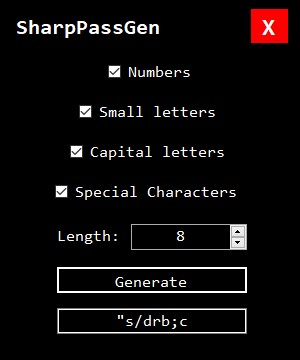
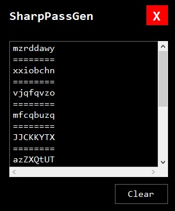

# SharpPassGen
A simple password generator built as practice with C#

## Download & use

You can download `SharpPassGen.exe` executable file from the [latest release](https://github.com/AliAlmasi/SharpPassGen/releases/latest). It is a portable program, therefore doesn't need to be installed and you can start to use it right away.

> Note: this program requires [dotnet framework 4 runtime](https://dotnet.microsoft.com/en-us/download/dotnet-framework/thank-you/net40-offline-installer) as it's dependency.

<table>
  <thead>
    <tr>
      <th>
Main window's screenshot
</th>
      <th>
History window's screenshot
</th>
    </tr>
  </thead>
  <tbody>
    <tr>
      <td>

</td>
      <td>

</td>
    </tr>
  </tbody>
</table>
